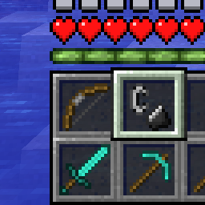
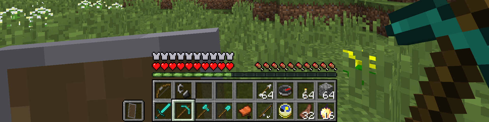
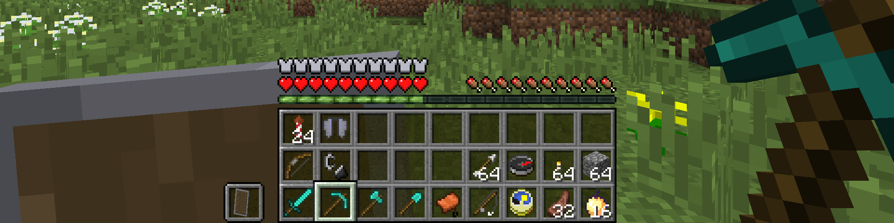
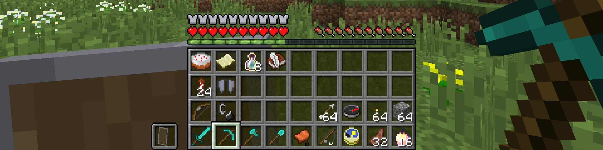
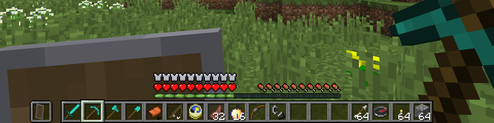
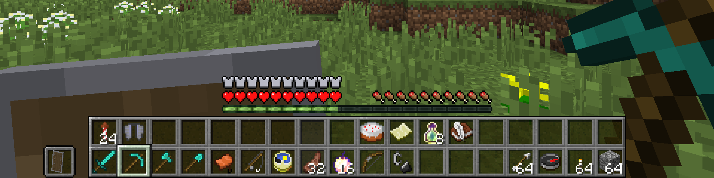
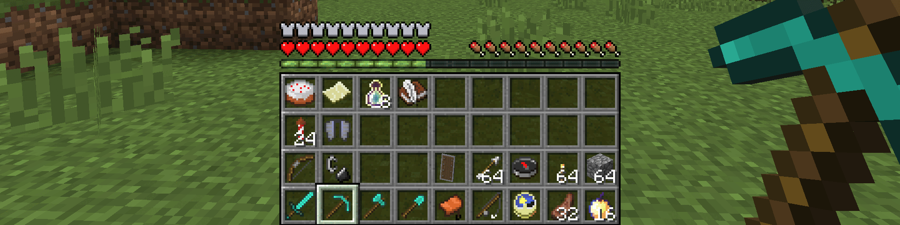
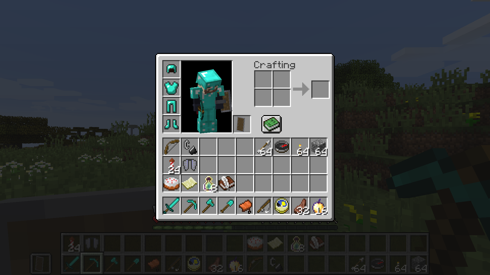

    

# DualHotbar Reworked
This is a fork of RebelKeithy's [DualHotbar](https://github.com/RebelKeithy/DualHotbar) that attempts to fix all the issues present in the 1.12.2 [ChrisLane port](https://github.com/ChrisLane/dual-hotbar).

 

## About DualHotbar
This mod allows you to use multiple rows of your inventory as hotbars at the same time.
It can be configured in different ways to render them stacked and/or next to each other.

The slots are taken from the top row of your inventory going downwards.

There are 3 ways to select an item from the new slots:
* You can simply scroll with the mouse wheel and cycle to items
* You can double tap the number key to cycle to the same slot between hotbars
* You can hold a configurable modifier key (ctrl by default) and the slot number

You can also use the mouse wheel and a configurable modifier key (ctrl by default) to swap full hotbar rows while in stacked mode.

## Bug fixes & Improvements
* Fixed rendering issues with offhand items and widget slots
* Fixed hotbar rendering not being disabled while in spectator mode
* Fixed a crash when picking a block using the mouse wheel ([#6](https://github.com/RebelKeithy/DualHotbar/issues/6))
* Fixed duplicated ghost items appearing when picking blocks in creative mode ([#8](https://github.com/RebelKeithy/DualHotbar/issues/8))
* Fixed incorrectly positioned items when picking blocks in creative mode ([#8](https://github.com/RebelKeithy/DualHotbar/issues/8))
* Improved offhand item rendering to align on the same row when hotbars are not stacked
* Fixed chat interaction hotspots (like click to execute/copy) when the hotbar is shifted up ([#5](https://github.com/RebelKeithy/DualHotbar/issues/5))
* Disabled slot switching and hotkeys while in GUIs to prevent unintended actions

## New features & Enhancements
* Added support for config synchronization when joining multiplayer servers
* Enabled in-place config updates without rejoining world or restarting the game
* Added compatibility with [LemonSkin](https://www.curseforge.com/minecraft/mc-mods/lemonskin)
  * Saturation, food, and health overlays are now rendered at the correct height
* Added compatibility with [SimpleDifficulty](https://www.curseforge.com/minecraft/mc-mods/simpledifficulty)
  * Temperature HUD is now rendered at the correct height

## Technical changes
* Replaced ASM with Mixins for better compatibility and maintainability
* Updated the config system and its validation
* Cleaned up and refactored most of the old messy code (probably fixed [#7](https://github.com/RebelKeithy/DualHotbar/issues/7))
* Migrated to Cleanroom's modern ForgeDevEnv

## Screenshots

### 1x2 configuration

### 1x3 configuration

### 1x4 configuration

### 2x1 configuration

### 2x2 configuration

### Hotbar swapping

### Inventory
